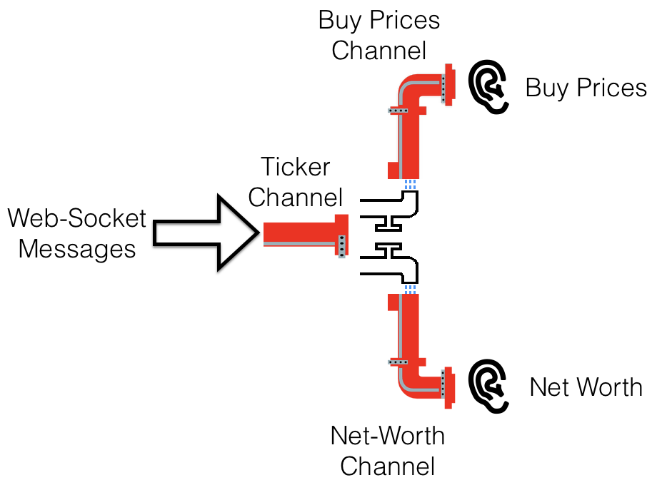
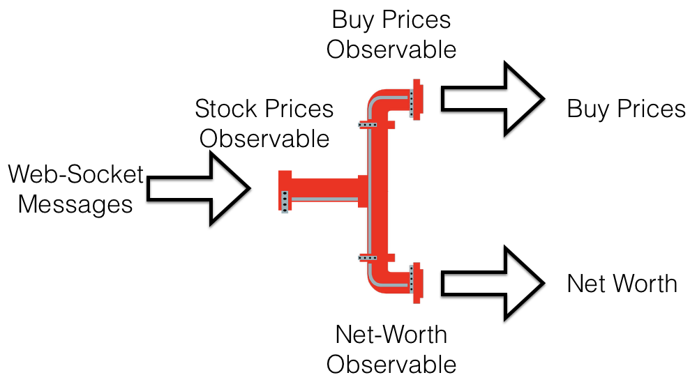

# Everything is an Event (Pushing Multiple Values)

In this melody, we will look at how reactive programming uses Functional Programming and increases the concurrency in the system.  

## Problem Statement
1. Streaming NetWorth
    * Given a bunch of stocks in user's portfolio, 
    * When the user subscribes to receiving price updates for them in   real-time, 
    * Then the porfolio calculates its Networth on every tick of any stock in it.

2. Buy Prices - A 2% brokerage is added to every price that the user sees for purchasing.

## CodeJugalbandi

**BRAHMA** In Clojure, we have the core-async library that can help us create a highly concurrent system.  Lets start by looking at the ```main``` function.  In here, we define a ```streamer```, which essentially creates a connection to the Web-Socket end-point using the supplied url and consumes ```on-connect``` and ```before-disconnect``` callbacks required for subscription and unsubscription by the end-point to which we are connecting.  Once the connection is made, we get a Channel - ```ch``` from the ```streamer```.  Along with that, we also get a ``stop-fn`` useful to stop streaming the prices.  

```clojure
(defn -main [& args]

  (do (def streamer (create-message-stream (get-ws-url)
                                           :on-connect subscribe
                                           :before-disconnect unsubscribe))
      (def ch (:ch streamer))
      (def stop-fn (:stop-fn streamer))
      (def m (async/mult ch)))

  (do
      (defonce portfolio (p/new-portfolio))
      (load-portfolio! portfolio (-> "portfolio.edn" slurp edn/read-string)))

  ;;;;;;;;;;;;;;;;;;;;;;;;;;;;;;;;;;;;;;;;;;;;;;;;;;;;;;;;;;;;;;;;;;;;;;;;;;;;;;;;;;;;;;;;;;;;;;;;;;;;;;;;;;;;;;;;;;;;;;
  (def print-stop-fn (add-listener m stock-info-printer))
  (def net-worth-print-stop-fn (add-listener m (net-worth-printer portfolio))))
```  
**BRAHMA** Now, in Clojure, we can only connect one listener to a channel, hence we need to create a multiplexed channel from the existing channel using the ```async/mult``` function.  To this async channel, we can then connect multiple listeners.  We connect two listeners - a ```buy-price-printer``` and a ```net-worth-printer``` and start listening to messages on that.  The overall connection look like as shown in the diagram below:



**BRAHMA** Now, lets look at the definitions of functions called from main, starting with the ```create-message-stream``` function.  

```clojure
defn create-message-stream [url & {:keys [on-connect before-disconnect]
                                    :or {on-connect identity before-disconnect identity}}]
  (let [ws-conn     (http/websocket-client url)
        ch          (chan (dropping-buffer 32) (map parse-message))
        stop?       (atom false)
        stop-fn     (fn []
                      (reset! stop? true)
                      (before-disconnect ws-conn)
                      (s/close! @ws-conn)
                      (async/close! ch))]

    (go-loop []
      (when-let [message @(s/take! @ws-conn)]
        (>! ch message)
        (if-not @stop?
          (recur))))

    (on-connect ws-conn)
    {:ch ch :stop-fn stop-fn}))
```

**BRAHMA** The core abstraction here is a Channel and is set-up by using the ```chan``` function.  Imagine a channel like a pipe, where at one end can push messages and listen to them at the other end by registering a listener. To this function, we pass a ```dropping-buffer``` which essentially drops the messages that it receives when the internal buffer becomes full.  We then transform the string messages it receives from the Websocket connection ```ws-conn``` to JSON and further to a map using the transformation function ```keyword``` 

```clojure
(defn- parse-message [message-str] (json/parse-string message-str keyword))
```

**BRAHMA** The channel is set into a continuous loop using ```go-loop``` and ```recur```. It loops until the stop function is called.  We read the message from ```ws-conn``` by ```deref```ing it and the associated stream.  This message is pushed on to the channel and is now available for the listeners.

**BRAHMA** Next, lets look at the ```add-listener``` function.
// Jaju, please fill up explanation here.

```clojure
(defn add-listener [m listener-fn]
  (let [stop?   (atom false)
        ch      (chan (async/dropping-buffer 32))
        _       (tap m ch)
        stop-fn (fn []
                  (untap m ch)
                  (reset! stop? true))]
    (go-loop []
      (when-let [message (<! ch)]
        (listener-fn message)
        (if-not @stop?
          (recur))))
    stop-fn))

```
**BRAHMA** So, thats how it looks using core-async library in Clojure.  Can you show me how would you implement this in languages like C#, Java or Scala

**KRISHNA** Ok, let me show you this using Reactive Extensions in Java.  Thisis the main method where all actions are happening.

```java
// Runner.java
public static void main(String[] args) throws Exception {
  // Stock Prices Stream
  Flowable<JSONObject> stockPrices = nationalStockExchangeFeed();
	
  double brokerage = 0.02;  // add 2% brokerage to every stock-price.
  Disposable buyPrices = pricesWithBrokerage(stockPrices, brokerage)
    .subscribe(tick -> System.out.println(String.format("Buy Price => [%s, %f]", tick.getString("ticker"), tick.getDouble("price"))), 
       error -> System.out.println("Error => " + error),
       () -> System.out.println("*** DONE Buy Price ***"));
    
  waitFor(8, TimeUnit.SECONDS);

  Portfolio myPortfolio = new Portfolio();
  myPortfolio.add("GOOG", 40);
  myPortfolio.add("AAPL", 30);
  myPortfolio.add("ORCL", 10);
  myPortfolio.add("MSFT", 10);
    
  Disposable netWorth = myPortfolio.netWorth(stockPrices)
    .subscribe(total -> System.out.println("NetWorth => " + total), 
       error -> System.out.println("Error => " + error),
       () -> System.out.println("*** DONE NetWorth ***"));
    
  stop(buyPrices, 6, TimeUnit.SECONDS);
  System.out.println("Stopped buyPrices");
  stop(netWorth, 6, TimeUnit.SECONDS);
  System.out.println("Stopped NetWorth");
}
```


**KRISHNA** As, you can see that ```nationalStockExchangeFeed()``` returns a continuous real-time price from the National Stock Service as a ```Flowable<JSONObject>```.  In RxJava2 there are two types, ```Observable``` and ```Flowable```.  The difference between them is that ```Flowable``` can handle backpressure, while Observable cannot.  In RxJava1, it was ```Observable``` only.  For the purposes of the current   explanation, I'll ignore this technical difference and treat ```Flowable``` and ``Observable`` in an informal sense by treating them synonymously.  So, though the code says ```Flowable```, I'll refer to it as an ```Observable```.  I'll come to ```Flowable``` when we see that piece of code.

```java
// Runner.java
static Flowable<JSONObject> nationalStockExchangeFeed() {
  return new RealTimeNationalStockService()
    .asFlowable()
    .filter(json -> json.has("ticker"));
}
```


**KRISHNA** This function uses ```RealTimeNationalStockService``` - a stand-in that subscribes to the realtime prices from the National Stock Service using Web-Socket and has an ```asFlowable()``` method to create an Observable.  As we receive other JSON messages along with stock price message, a filter has been set-up to allow only pricing related messages.  Now, lets look at the ```asFlowable()``` method of the ```RealTimeNationalStockService```

```java
// RealTimeNationalStockService.java
public Flowable<JSONObject> asFlowable(String ticker) {
  String statusMsg = String.format("RealTimeNationalStockServiceObservable.asFlowable(%s): ", ticker);
  System.out.println(statusMsg + "Ready...");
  return Flowable.<String>create(subscriber -> {
    try {
      final String clientId = subscribeTo(ticker, 
      message -> subscriber.onNext(message), 
      error -> subscriber.onError(error), 
      (code, reason) -> subscriber.onComplete());

      subscriber.setCancellable(() -> {
        if (!clientId.isEmpty()) {
          System.out.println(statusMsg + "Unsubscribing..."); 
          unsubscribe(clientId);
          System.out.println(statusMsg + "Closing...");             
          close(clientId);
          System.out.println(statusMsg + "Closed.");                         
        }
      });
    } catch (MalformedURLException | URISyntaxException e) {
      subscriber.onError(e);
    } 
  }, BackpressureStrategy.DROP)
  .subscribeOn(Schedulers.io())
  .observeOn(Schedulers.computation())
  .map(message -> new JSONObject(message))
  .share();
}
```

**KRISHNA** It creates a Flowable<JSONObject> using the ```create()``` factory method.  This is where we ```subscribeTo()``` to the callbacks provided by this service.  Additionally, we set the cancellation callback using the ```setCancellable()``` which gets invoked when there are no subscribers left or there is an explicit call to ```dispose()``` the subscription.  Afterall, we don't want to hang-on an expensive Web-Socket connection and go on pushing messages when no one is subscribed.   The last parameter, is the ```BackPressureStrategy``` which is set to ```DROP```, exactly like in the Clojure code.

**KRISHNA**  Lets look down the Observable pipeline.  The two operators in ```Rx``` that enable concurrency is ```subscribeOn``` and ```observeOn```.  Both these operators need Schedulers to allocate work on its threads.  As in the create method, we are doing IO operation using Web-Socket, we use a special IO scheduler and further down the pipeline, it will be all computations, like converting a string message to a JSON message, adding brokerage etc..., so we use the Computational Schduler.  So, at this point, data-emissions switch threads.  

```java
public Flowable<JSONObject> asFlowable(String ticker) {
  String statusMsg = String.format("RealTimeNationalStockServiceObservable.asFlowable(%s): ", ticker);
  System.out.println(statusMsg + "Ready...");
  return Flowable.<String>create(subscriber -> { ... }, BackpressureStrategy.DROP)
  .subscribeOn(Schedulers.io())
  .observeOn(Schedulers.computation())
  .map(message -> new JSONObject(message))
  .share();
}
```

**KRISHNA** Also, using ```share()```, we make this Observable hot.  In ```Rx```, an observable can either be hot or cold.  Hot observables are shared by all the subscribers, whereas when a subscriber connects to a cold observable, it gets a brand new observable with an new Web-Socket connection.  So, to prevent this expensive resource creation again and again, we do resource sharing using the ```share()``` operator.  This is quite similar like the ```tap```s used in the above Clojure code for attaching multiple channels.

**KRISHNA** Finally, we create ```pricesWithBrokerage ``` stream 

```java
static Flowable<JSONObject> pricesWithBrokerage(Flowable<JSONObject> stockPrices, double brokerage) {
  return stockPrices.map(message -> {
    double brokeredPrice = message.getDouble("price") * (1 + brokerage);
    message.put("price", brokeredPrice);
    return message;
  });
}
```

and the ```netWorth``` using the ```stockPrices``` stream.  In the ```netWorth``` stream, we calculate the running total on each tick using ```scan```, ```map``` and ```reduce``` operators.

```java
public Flowable<Double> netWorth(Flowable<JSONObject> stockPrices) throws Exception {
  return stockPrices
    .filter(tick -> stocks.containsKey(tick.getString("ticker")))
    .scan(new HashMap<String, Double>(), (acc, tick) -> {
      String ticker = tick.getString("ticker");
      acc.put(ticker, stocks.get(ticker) * tick.getDouble("price"));
      return acc;  
    })
    .map(worth -> worth.values().stream().reduce(0d, (a, e) -> a + e));
}
```

So, on each price tick, all the things are re-calculated, without making the system unresponsive.  In case, we don't need any of the streams, we can then dispose them off and when we need them, we can start them again.

```java
public static void main(String[] args) throws Exception {

  ...
  ...  
  
  Disposable netWorth = myPortfolio.netWorth(stockPrices)
    .subscribe(total -> System.out.println("NetWorth => " + total), 
       error -> System.out.println("Error => " + error),
       () -> System.out.println("*** DONE NetWorth ***"));
    
  stop(buyPrices, 6, TimeUnit.SECONDS);
  System.out.println("Stopped buyPrices");
  stop(netWorth, 6, TimeUnit.SECONDS);
  System.out.println("Stopped NetWorth");
    
  System.out.println("Starting NetWorth Again...");
  netWorth = myPortfolio.netWorth(stockPrices)
    .subscribe(total -> System.out.println("NetWorth => " + total), 
       error -> System.out.println("Error => " + error),
       () -> System.out.println("*** DONE NetWorth ***"));
    
  stop(netWorth, 7, TimeUnit.SECONDS);
  System.out.println("Stopped NetWorth Again!");
}
```

**BRAHMA** So, thats using Rx we've solved the problem.  Now lets reflect on the two approaches.

## Reflections (TODO)

**BRAHMA** 


**KRISHNA** 


